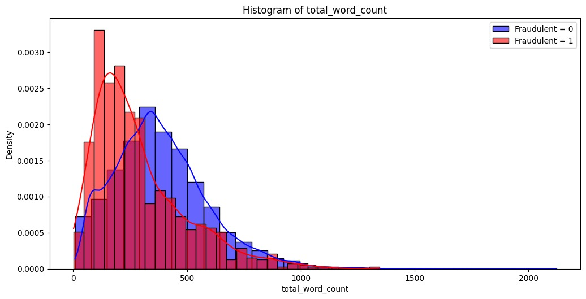

<h1 align='center' style="text-align:center; font-weight:bold; font-size:2.5em"> Detecting Fake Job Listings </h1>

    <a>Shani Angel</a>&nbsp;,&nbsp;
    <a>Saar Manshrov</a>&nbsp;,&nbsp;
    <a >Nitzan Manor</a>&nbsp;&nbsp;
    <a>Shachaf Chaviv</a>&nbsp;&nbsp;
      
    Technion - Israel Institute of Technology  

 
 

  
  

[//]: # (# Job Listing Authenticity Detector)

[//]: # ()
[//]: # (![Real Job]&#40;./images/real.jpg&#41;  )

[//]: # (![Fake Job]&#40;./images/fake.jpg&#41;)

## Abstract
Fraudulent job postings pose a significant risk to job seekers, exposing them to scams, data breaches, and other forms of exploitation. This research presents a robust AI-powered framework designed to detect and mitigate deceptive job listings. Using a dataset of job postings scraped from Indeed, we employed rigorous preprocessing and leveraged big data to inform feature engineering and develop a learning-driven solution. The system is deployed in a newly designed user interface, enabling users to search for job listings and receive real-time predictions on their authenticity. This innovative tool improves transparency and user trust, offering an accessible and effective means of protecting job seekers.

---

## Key Features
- **Job Listings Scraping**: Automates the scraping of job postings from Indeed using `ScraperAPI` or `Bright Data` proxy services.
- **Data Enrichment**: Utilizes big data from LinkedIn to enrich the dataset for better feature engineering.
- **Data Preprocessing**: Handles missing data using `Gemini 1.5 Flash Model` and applies robust feature engineering.
- **Machine Learning Models**: Trains and evaluates various classifiers to predict job posting authenticity.
- **Interactive UI**: Deploys a user-friendly interface to search job listings and receive real-time predictions.

---

## Data
- **Primary Dataset**: [Real or Fake Job Postings](https://www.kaggle.com/datasets/shivamb/real-or-fake-fake-jobposting-prediction) from Kaggle, containing labeled data of real and fake job postings.
- **Supplementary Data**: LinkedIn big data companies table for enriching features.

### Data Preprocessing Insights
  
The above visualization highlights the word count distribution in job descriptions. Fake job postings often have fewer words compared to real postings, a critical feature for model differentiation.

---

## Folder Structure
- **`scraping/`**: Contains code for scraping job postings from Indeed and exporting to Excel. Requires `ScraperAPI` API key or `Bright Data` proxy.
- **`pre_process/`**: 
  - `FeatureEngineering.ipynb`: Integrates big data features into the dataset.
  - `FillMissingValues.ipynb`: Uses `Gemini 1.5 Flash Model` to fill missing values in scraped data.
- **`analyse/`**: Includes notebooks for data visualization and exploratory data analysis (EDA).

---

## Usage Instructions
1. **Set Up Scraping**:
   - Obtain an API key from `ScraperAPI` or credentials for `Bright Data` proxy.
   - Run the scripts in the `scraping/` folder to collect job postings.

2. **Preprocess Data**:
   - Navigate to the `pre_process/` folder.
   - Execute `FeatureEngineering.ipynb` and `FillMissingValues.ipynb` to prepare the dataset for modeling.

3. **Analyze Data**:
   - Explore the insights in the `analyse/` folder notebooks.

4. **Run Models**:
   - Train and evaluate classifiers using the enriched dataset.
   - Integrate the model predictions into the user interface for real-time evaluation.

---

## Team Members
- Saar Manshrov
- Shani Angel
- Shachaf Haviv
- Nitzan Manor